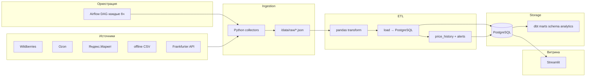

# Мониторинг цен товаров

Pet-проект: сбор цен с маркетплейсов, raw-слой, ETL в PostgreSQL, оркестрация Airflow, трансформации dbt, дашборд Streamlit, алерты и простой ML-прогноз.

## Архитектура



## Стек

| Слой          | Технологии                                                |
| ------------- | --------------------------------------------------------- |
| Ingestion     | Python, `requests`, BeautifulSoup, Selenium (опционально) |
| Raw storage   | `data/raw/{source}/*.json` (+ метаданные в JSON)          |
| Orchestration | Apache Airflow 2.8 (Docker)                               |
| Warehouse     | PostgreSQL 15                                             |
| Transform     | pandas, **dbt** (schema `analytics`)                      |
| Dashboard     | Streamlit + Plotly                                        |
| Alerts        | Telegram Bot API                                          |
| ML            | scikit-learn Linear Regression                            |

## Структура репозитория

```
price_monitoring/
├── airflow/dags/          # DAG ingest → transform → load → analytics
├── dashboard/             # Streamlit
├── data/raw/              # сырые JSON после ingestion
├── data/sample/           # offline CSV
├── dbt/                   # staging + marts
├── scripts/               # локальный пайплайн и seed
├── sql/init_schema.sql    # DDL: products, prices, price_history
├── src/
│   ├── ingestion/         # коллекторы маркетплейсов
│   ├── etl/               # transform, load, analytics, ML
│   └── alerts/
└── docker-compose.yml     # Postgres + Airflow
```

## Таблицы PostgreSQL

- **products** — справочник товаров (`external_id`, `source`, `name`, `category`, `brand`)
- **prices** — срезы цен (`price`, `price_rub`, `currency`, `availability`, `raw_payload` JSONB)
- **price_history** — дневные агрегаты (`min/max/avg`, статус наличия)
- **raw_ingestion_log** — журнал загрузок raw
- **currency_rates** — курсы для конвертации в RUB

## Быстрый старт

### 1. Окружение

```bash
cd price_monitoring
python3 -m venv .venv
source .venv/bin/activate
pip install -r requirements.txt
cp .env.example .env
```

### 2. PostgreSQL

```bash
docker compose up -d postgres
```

Порт `5432`, БД `price_monitoring`, пользователь `de_user` / `de_password`.

### 3. Пайплайн (локально)

```bash
# один прогон
PYTHONPATH=src python scripts/run_pipeline.py

# несколько прогонов для графиков и % изменения
PYTHONPATH=src python scripts/seed_history.py
```

### 4. Дашборд

```bash
PYTHONPATH=src streamlit run dashboard/app.py
```

Фильтры: магазин, бренд, категория. Графики: динамика цен, топ изменений, средние по категориям, прогноз LR.

### 5. Airflow (опционально)

```bash
docker compose build
docker compose up -d
```

- UI: http://localhost:8080 (`admin` / `admin`)
- DAG: `price_monitoring_pipeline`, расписание `0 */6 * * *`

Включите DAG и запустите вручную для первого прогона.

### 6. dbt

```bash
pip install dbt-postgres
cd dbt
dbt debug
dbt run
dbt test   # при добавлении tests/
```

Модели: `stg_*`, `mart_daily_category_prices`, `mart_price_trends` в schema `analytics`.

## Режимы сбора данных

| Переменная         | Значение     | Описание                                            |
| ------------------ | ------------ | --------------------------------------------------- |
| `INGEST_MODE=demo` | по умолчанию | Реалистичные демо-цены (для портфолио и CI)         |
| `INGEST_MODE=live` | опционально  | Попытка парсинга HTML; при ошибке — fallback в demo |

> Маркетплейсы защищены антиботом. Для продакшена партнёрские API, Selenium (`src/ingestion/selenium_collector.py`) или прокси.

## Алерты Telegram

В `.env`:

```
TELEGRAM_BOT_TOKEN=...
TELEGRAM_CHAT_ID=...
ALERT_PRICE_CHANGE_PCT=15
```

При изменении цены ≥ 15% между двумя последними срезами — сообщение в чат.
